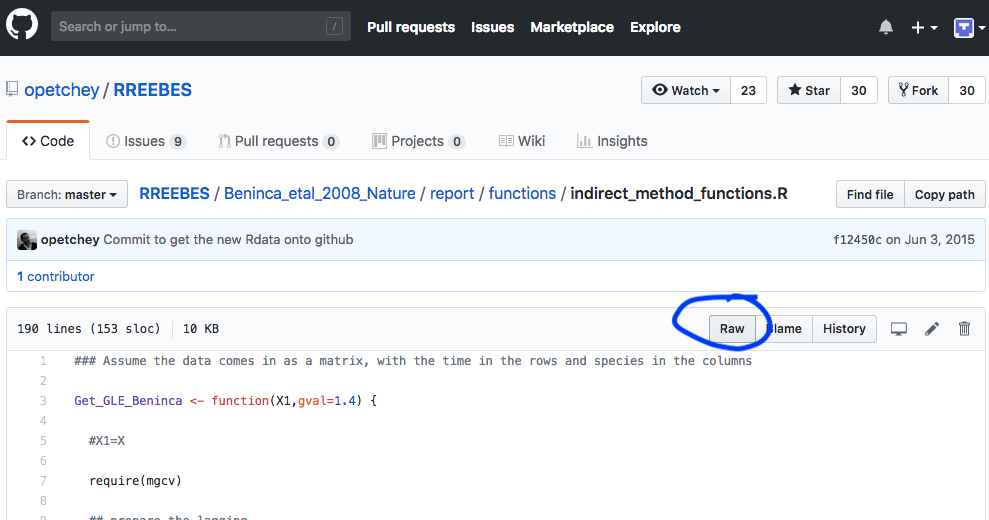
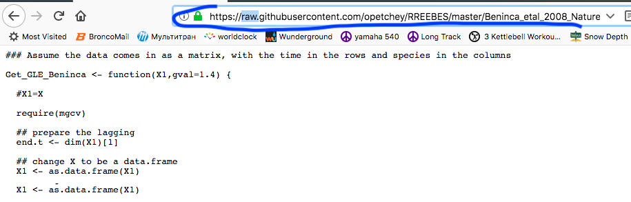

```{r setup, include = FALSE}
knitr::opts_chunk$set(
  collapse = TRUE,
  comment = "#>"
)
```
##Create a file directly from a URL
This function was created to streamline the process of downloading files from URLs. The usual approach is to download a file onto OS storage, then drag and drop or copy and paste. This can create duplicate files, incomplete or incorrect transfer; this is a fragile, low fidelity processs. Another benefit, in terms of reproducability is that the URL where the data was aquired can be a part of the markdown file. This makes the URL clear and accessable when generating citations and easily updated when needed. NOTE: you may need to change the URL in this vigenette, since they are frequently updated.

The file below is an R script from a github repository. Function could be useful for downloading only data or a file from a github repository; rather than the whole directory and contents.

###Example: Find data on Github
In this example, we are going to download an `R script` from Github. Circa 2018, you can find the raw address by navigating directly to a file within a repository. 
```{r figure1, echo=FALSE, fig.cap="Find Github Raw Address", out.width = '100%'}

```
After clicking on the "Raw" button circled above, the browser will display the contents of the file. Copy the URL and paste in quotes in the `url2file` function, as the first arguement. 
```{r figure2, echo=FALSE, fig.cap="Copy Raw Address", out.width = '100%'}

```

The 'raw' section of the URL is highlighted above. In the Github environment, 'raw' refers to pages that display script or data files - the kind we can use in R. If the page is not at a 'raw' address, then a copy of the webpage will be downloaded. 

###Paste URL into `url2file` function
In the first example below, the URL is pasted within quotes, and the `dirID` (directory identity or file name) is left blank. In this case, a new file will be created with the default name "Downloaded_files". You can refer to the `url2file.R` in the package files to see the exact script of this function. 
```{r example 1 url2file, eval=FALSE, out.width = '100%'}
url2file("https://raw.githubusercontent.com/opetchey/RREEBES/Beninca_development/Beninca_etal_2008_Nature/report/functions/indirect_method_functions.R", dirID = )
```

The default filename can be changed to anything you wish by specifying a different name.
```{r example 2 url2file, eval=FALSE, out.width = '100%'}
url2file("https://raw.githubusercontent.com/opetchey/RREEBES/Beninca_development/Beninca_etal_2008_Nature/report/functions/indirect_method_functions.R", dirID = "Rscripts")
```

#####Note: "url2file" creates a new folder "Downloaded_files" in the same file as where the R script is executed. Reference and relocate accordingly!! 

#####Wishing you happy files!
